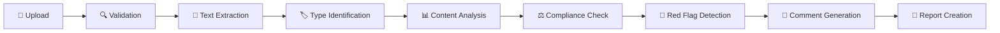

# 🏛️ ADGM Corporate Agent - Document Intelligence System

<div align="center">


**🎯 AI-Powered Legal Assistant for Abu Dhabi Global Market (ADGM) Compliance**

*Intelligent document analysis • Automated compliance checking • Professional legal guidance*

[🚀 Quick Start](#-quick-start) • [📋 Features](#-features) • [🎮 Usage Guide](#-usage-guide) • [🛠️ Development](#️-development)

</div>

---

## 🌟 Overview

The **ADGM Corporate Agent** is an advanced AI-powered legal assistant specifically designed for reviewing, validating, and preparing documentation for business incorporation and compliance within the **Abu Dhabi Global Market (ADGM)** jurisdiction.

### ✨ What Makes It Special

🔥 **RAG-Enhanced Analysis** using official ADGM regulations and templates  
🔍 **Automated Red Flag Detection** for legal and compliance issues  
📋 **Document Checklist Verification** against ADGM requirements  
💬 **Intelligent Inline Commenting** with contextual legal suggestions  
📊 **Advanced Compliance Scoring** with quantitative risk assessment  
🏛️ **Official ADGM Integration** with real government templates and regulations

---

## 🚀 Quick Start

### 📋 Prerequisites

- **Python 3.8+** 
- **pip** package manager
- **Git** (optional, for cloning)

### ⚡ Installation

#### 1. **Clone or Download the Repository**
```bash
git clone <repository-url>
cd adgm-corporate-agent
```

#### 2. **Create Virtual Environment** (Recommended)
```bash
python -m venv venv

# Activate virtual environment
source venv/bin/activate          # On macOS/Linux
# OR
venv\Scripts\activate             # On Windows
```

#### 3. **Install Dependencies**
```bash
pip install -r requirements.txt
```

#### 4. **Set Environment Variables** (Optional)
```bash
# For enhanced AI capabilities (optional)
export OPENAI_API_KEY="your-openai-api-key"
```

### 🎯 Running the Application

#### **Option 1: Streamlit Interface** 🌟 **(Recommended)**
```bash
streamlit run streamlit_app.py
```
🌐 **Access at:** `http://localhost:8501`

**Features:**
- 📱 Mobile-responsive design
- 🎨 Professional UI with dark theme
- 📊 Real-time compliance scoring
- 📋 Interactive results display
- 💾 Direct download capabilities

#### **Option 2: Gradio Interface** ⚡ **(Alternative)**
```bash
python main.py
```
🌐 **Access at:** `http://localhost:7860`

**Features:**
- 🚀 Fast loading and processing
- 🔄 Drag-and-drop file uploads
- 📄 Enhanced document review generation
- 📈 Comprehensive JSON reporting

#### **Option 3: Flask Interface** 🌐 **(Lightweight)**
```bash
python flask_app.py  # If available
```
🌐 **Access at:** `http://localhost:5000`

---

## 🎨 User Interface Preview

### Streamlit Interface
```
🏛️ ADGM Corporate Agent
Enhanced Abu Dhabi Global Market (ADGM) Compliant Legal Document Review System

┌─────────────────────────────────┬─────────────────────────────────┐
│  📁 Upload Documents            │  📊 Analysis Results            │
│                                 │                                 │
│  [📄 Select Files (.docx)]     │  👆 Upload and analyze         │
│                                 │     documents to see            │
│  🔍 [Analyze Documents]         │     comprehensive results       │
│                                 │                                 │
└─────────────────────────────────┴─────────────────────────────────┘

📋 Enhanced Features:
• 🔍 Advanced document analysis & red flag detection
• ⚖️ ADGM jurisdiction verification
• 📋 Official template compliance validation
• 💬 Professional inline commenting with citations
• 📊 Quantitative compliance scoring
```

### Key UI Components

| Component | Description | Features |
|-----------|-------------|----------|
| **📁 Upload Area** | Drag-and-drop document upload | Multiple .docx files, 200MB limit |
| **📊 Compliance Score** | Real-time scoring display | Color-coded: 🌟 Excellent, ✅ Good, ⚠️ Moderate, ❌ Poor |
| **🚩 Issues Panel** | Detailed issue breakdown | Severity levels: Critical, High, Medium, Low |
| **📋 Results Dashboard** | Comprehensive analysis view | Executive summary, missing docs, recommendations |
| **💾 Export Options** | Download capabilities | JSON reports, reviewed documents, summaries |

---

## 📋 Features

### 🎯 Core Capabilities

#### **1. 📄 Document Upload & Processing**
- ✅ Accepts multiple .docx files simultaneously
- 🔍 Automatic document type identification with AI
- 📝 Advanced text extraction and parsing
- 🏷️ Smart categorization and classification

#### **2. 🏛️ ADGM Compliance Analysis**
- ⚖️ **Jurisdiction Verification** (ADGM vs other UAE courts)
- 📋 **Template Compliance Checking** against official ADGM templates
- 📊 **Regulatory Requirement Validation** with current regulations
- 🔗 **Cross-Reference Verification** with official ADGM documents

#### **3. 🚨 Advanced Red Flag Detection**
- ❌ Invalid or missing legal clauses
- 🏛️ Incorrect jurisdiction references  
- 🔍 Ambiguous or non-binding language
- ✍️ Missing signatory sections
- 📝 Incomplete placeholder text
- 🎯 **AI-powered severity classification**

#### **4. ✅ Document Checklist Verification**
- 🔄 Automatic process recognition (incorporation, licensing, etc.)
- 📋 Required document identification
- ⚠️ Missing document alerts with recommendations
- 📈 Completion percentage tracking

#### **5. 🤖 Intelligent Commenting System**
- 💬 AI-generated inline comments in .docx files
- 📚 Official ADGM regulation citations
- 💡 Actionable improvement suggestions
- 🎯 Context-aware recommendations

### 🏢 Supported Document Types

#### **🏛️ Company Formation Documents**
| Document Type | Description | Status |
|---------------|-------------|---------|
| **Articles of Association (AoA)** | Company constitution and governance | ✅ Full Support |
| **Memorandum of Association (MoA)** | Company objectives and activities | ✅ Full Support |
| **Board Resolution Templates** | Directors' decision documents | ✅ Full Support |
| **Shareholder Resolution Templates** | Shareholders' decision documents | ✅ Full Support |
| **Incorporation Application Form** | Official ADGM incorporation filing | ✅ Full Support |
| **UBO Declaration Form** | Ultimate Beneficial Ownership disclosure | ✅ Full Support |
| **Register of Members and Directors** | Statutory registers | ✅ Full Support |
| **Change of Registered Address Notice** | Address change notifications | ✅ Full Support |

#### **👥 Employment & HR Documents**
- 📄 ADGM Standard Employment Contracts (2024)
- 📚 Employee Handbooks
- 📋 Workplace Policies
- 🛡️ Data Protection Policies

#### **📜 Licensing & Regulatory Documents**
- 🏛️ License Applications
- 📊 Regulatory Filings
- ✅ Compliance Certificates
- 📋 Risk Management Policies

#### **🤝 Commercial Agreements**
- 📝 Service Agreements
- 💼 Commercial Contracts
- 📋 Terms and Conditions
- 🔒 Confidentiality Agreements

---

## 🎮 Usage Guide

### 🔥 Basic Workflow

#### **Step 1: 📁 Upload Documents**
1. Click **"📁 Upload Documents"** or **"Browse files"**
2. Select one or more **.docx files**
3. Supported types: AoA, MoA, contracts, applications, etc.
4. Maximum file size: **200MB per file**

#### **Step 2: 🔍 Analyze Documents**
1. Click **"🔍 Analyze Documents for ADGM Compliance"**
2. System processes and analyzes all uploaded files
3. AI performs comprehensive compliance review
4. Review real-time analysis status and progress

#### **Step 3: 📊 Review Results**
1. **📄 Reviewed Document**: Download .docx with professional inline comments
2. **📋 JSON Report**: Detailed structured analysis with issues and suggestions
3. **📈 Status Summary**: High-level compliance overview and executive summary
4. **💡 Recommendations**: Actionable next steps for improvement

### 📊 Understanding Results

#### **🎯 Compliance Score Breakdown**
| Score Range | Status | Description | Action Required |
|-------------|--------|-------------|-----------------|
| **90-100** | 🌟 **Excellent** | Minimal issues, ready for submission | Final review recommended |
| **80-89** | ✅ **Good** | Minor issues, good compliance level | Address identified issues |
| **60-79** | ⚠️ **Moderate** | Several issues need attention | Significant improvements needed |
| **0-59** | ❌ **Poor** | Major compliance gaps | Comprehensive revision required |

#### **🚨 Issue Severity Levels**
| Severity | Icon | Description | Priority |
|----------|------|-------------|----------|
| **Critical** | 🚨 | Fundamental legal/compliance violations | **Immediate Action** |
| **High** | 🔴 | Important legal improvements needed | **High Priority** |
| **Medium** | 🟡 | Recommended enhancements | **Medium Priority** |
| **Low** | 🟢 | Minor suggestions for optimization | **Low Priority** |

### 📋 Sample Analysis Output

```json
{
  "metadata": {
    "analysis_date": "2025-08-11T15:30:00Z",
    "system_version": "Enhanced ADGM Corporate Agent v2.0"
  },
  "process": "company_incorporation",
  "documents_uploaded": 4,
  "required_documents": 5,
  "missing_documents": [
    "Register of Members and Directors"
  ],
  "compliance_score": 84.2,
  "risk_level": "LOW RISK",
  "issues_found": [
    {
      "document": "Articles of Association",
      "section": "Clause 3.1 - Jurisdiction",
      "issue": "Jurisdiction clause does not specify ADGM Courts",
      "severity": "High",
      "suggestion": "Update jurisdiction clause to specify ADGM Courts exclusively",
      "adgm_reference": "ADGM Companies Regulations 2020, Article 6",
      "confidence": 0.95,
      "category": "jurisdiction"
    }
  ],
  "recommendations": [
    "🚨 Address all high-priority jurisdiction issues immediately",
    "📋 Prepare missing Register of Members and Directors",
    "🏛️ Ensure all documents reference ADGM jurisdiction",
    "📚 Review against official ADGM templates"
  ],
  "executive_summary": "Good compliance level with minor jurisdiction issues to resolve..."
}
```

---

## 🔧 Configuration & Customization

### 🏛️ ADGM Knowledge Base

The system includes comprehensive built-in knowledge of:

| Regulation | Year | Coverage |
|------------|------|----------|
| **ADGM Companies Regulations** | 2020 | Company formation, governance, compliance |
| **ADGM Employment Regulations** | 2019 | Employment contracts, HR policies |
| **ADGM Data Protection Regulations** | 2021 | Privacy, data handling, consent |
| **ADGM Financial Services Regulations** | 2015 | Financial licensing, compliance |

### ⚙️ Customization Options

#### **1. 📄 Document Templates**
```python
# Add new document type recognition patterns
def add_custom_document_type(doc_type, keywords, patterns):
    # Implementation for custom document types
    pass
```

#### **2. 📋 Regulatory Rules**
```python
# Update compliance checking logic
def update_compliance_rules(new_rules):
    # Implementation for rule updates
    pass
```

#### **3. 🚨 Red Flag Patterns**
```python
# Modify detection algorithms
red_flag_patterns = {
    "custom_category": {
        "patterns": [r"pattern1", r"pattern2"],
        "severity": "High",
        "message": "Custom compliance issue detected"
    }
}
```

#### **4. 📊 Scoring Weights**
```python
# Adjust compliance scoring parameters
scoring_weights = {
    "Critical": 25,
    "High": 15,
    "Medium": 8,
    "Low": 3
}
```

---

## 🛠️ Development

### 📁 Project Structure

```
adgm-corporate-agent/
├── 📄 main.py                     # Main Gradio application
├── 🌐 streamlit_app.py           # Streamlit web interface  
├── 🌍 flask_app.py               # Flask alternative interface
├── 📋 requirements.txt           # Python dependencies
├── 📖 README.md                  # This documentation
├── 📊 adgm_knowledge_base.py     # ADGM regulations database
├── 🔍 document_processor.py      # Document analysis engine
├── 🤖 rag_engine.py              # RAG implementation
├── 🛠️ utils/                      # Utility functions
│   ├── helpers.py
│   └── validators.py
├── 📄 templates/                 # ADGM document templates
│   ├── aoa_template.docx
│   ├── moa_template.docx
│   └── employment_contract.docx
├── 🧪 tests/                     # Unit tests
│   ├── test_document_processor.py
│   ├── test_compliance.py
│   └── test_integration.py
├── 📂 examples/                  # Sample documents
│   ├── sample_aoa.docx
│   └── sample_employment.docx
├── 📊 outputs/                   # Generated reports
├── 📜 logs/                      # Application logs
└── 🔧 config/                    # Configuration files
    └── settings.yaml
```

### 🚀 Adding New Features

#### **1. 📄 New Document Types**
```python
def add_document_type():
    # Update DocumentProcessor.identify_document_type()
    doc_types = {
        "new_document_type": {
            "keywords": [("keyword", weight)],
            "section_patterns": [r"pattern1", r"pattern2"]
        }
    }
```

#### **2. 🚨 Custom Red Flags**
```python
def add_red_flag():
    # Extend red_flag_patterns in ADGMKnowledgeBase
    new_pattern = {
        "pattern_name": {
            "patterns": [r"regex_pattern"],
            "severity": "High",
            "category": "compliance",
            "message": "Issue description"
        }
    }
```

#### **3. 🏛️ Additional Processes**
```python
def add_process():
    # Add to adgm_documents dictionary
    new_process = {
        "process_name": {
            "required_docs": ["doc1", "doc2"],
            "optional_docs": ["doc3"],
            "official_templates": {"template_url": "url"}
        }
    }
```

#### **4. 🤖 Enhanced RAG**
```python
def enhance_rag():
    # Implement vector embeddings for better context retrieval
    from sentence_transformers import SentenceTransformer
    model = SentenceTransformer('all-MiniLM-L6-v2')
    # Enhanced implementation
```

### 🧪 Testing

```bash
# Run all unit tests
pytest tests/ -v

# Run with coverage report
pytest --cov=. tests/ --cov-report=html

# Run specific test categories
pytest tests/test_document_processor.py -v
pytest tests/test_compliance.py -v

# Manual testing with sample documents
python test_samples.py

# Performance testing
python performance_test.py
```

### 🔧 Development Setup

```bash
# Install development dependencies
pip install -r requirements-dev.txt

# Set up pre-commit hooks
pre-commit install

# Run code formatting
black .
flake8 .
isort .

# Type checking
mypy main.py
```

---

## 📊 Technical Architecture

### 🤖 RAG Implementation

#### **Knowledge Base Architecture**
```
🧠 ADGM Knowledge Base
├── 📚 Regulation Documents
│   ├── Companies Regulations 2020
│   ├── Employment Regulations 2019
│   └── Data Protection Regulations 2021
├── 📄 Official Templates
│   ├── AoA Templates
│   ├── Employment Contracts
│   └── License Applications
├── 🔍 Vector Store
│   ├── Sentence Embeddings
│   ├── Document Similarity
│   └── Context Matching
└── 🎯 Retrieval Engine
    ├── Query Processing
    ├── Context Extraction
    └── Relevance Scoring
```

#### **RAG Pipeline**
1. **📝 Query Processing** → User question analysis and intent detection
2. **🔍 Document Retrieval** → Relevant ADGM regulation matching
3. **🎯 Context Extraction** → Key information identification
4. **🤖 Response Generation** → Contextual advice and suggestions
5. **✅ Validation** → Accuracy checking and confidence scoring

### 🔄 Document Processing Pipeline



#### **Processing Stages**
1. **📁 Upload** → File validation and security scanning
2. **📝 Analysis** → Document type identification and content parsing  
3. **⚖️ Compliance** → ADGM rule matching and regulation verification
4. **🚨 Detection** → Red flag identification and severity classification
5. **💬 Annotation** → Inline commenting and suggestion generation
6. **📊 Output** → Reviewed document and structured report generation

---

## 📚 ADGM Resources & References

### 🏛️ Official ADGM Links

| Resource | Description | URL |
|----------|-------------|-----|
| **🏛️ Registration Authority** | Official incorporation guidance | [ADGM Registration](https://www.adgm.com/registration-authority/registration-and-incorporation) |
| **🏢 Company Formation** | Templates and requirements | [Company Setup](https://www.adgm.com/setting-up) |
| **⚖️ Legal Framework** | Regulations and policies | [Legal Guidance](https://www.adgm.com/legal-framework/guidance-and-policy-statements) |
| **👥 Employment Templates** | HR and employment resources | [Employment Contracts](https://assets.adgm.com/download/assets/ADGM+Standard+Employment+Contract) |
| **🔒 Data Protection** | Privacy and data handling | [Data Protection Office](https://www.adgm.com/office-of-data-protection) |

### 📋 Regulatory References

#### **📖 Primary Regulations**
- **🏛️ ADGM Companies Regulations 2020** - Complete corporate governance framework
- **👥 ADGM Employment Regulations 2019** - Employment law and HR requirements  
- **🔒 ADGM Data Protection Regulations 2021** - Privacy and data protection compliance
- **💼 ADGM Financial Services Regulations 2015** - Financial services licensing

#### **📄 Key Templates**
- **📋 Articles of Association Templates** - Official company constitution formats
- **👥 Employment Contract Templates (2024)** - Updated HR contract standards
- **🏛️ Board Resolution Templates** - Standard decision-making documents
- **🔒 Data Protection Policy Templates** - Privacy compliance frameworks

---

## 🚨 Important Legal Information

### ⚖️ System Purpose & Limitations

> **🎯 Purpose:** This enhanced AI system provides comprehensive guidance for ADGM compliance analysis and document review to assist legal professionals and businesses.

#### **✅ What This System Does**
- ✅ Analyzes documents against official ADGM regulations
- ✅ Identifies potential compliance issues and risks
- ✅ Provides actionable recommendations and improvements
- ✅ Generates professional reports with legal citations
- ✅ Streamlines document review processes

#### **❌ What This System Does NOT Do**
- ❌ Provide formal legal advice or opinions
- ❌ Replace qualified legal professionals
- ❌ Guarantee regulatory approval or compliance
- ❌ Make binding legal determinations
- ❌ Assume liability for legal outcomes

### 🎯 Professional Use Guidelines

**👩‍💼 Intended Users:**
- Legal professionals and corporate counsel
- Business formation specialists and consultants
- Compliance officers and risk managers
- Corporate secretaries and administrators
- ADGM-focused legal practitioners

**📊 Accuracy Standards:**
- Analysis based on current official ADGM regulations and templates
- Regular updates to reflect regulatory changes
- AI-powered analysis with human oversight recommended
- Professional-grade guidance suitable for legal review

### ⚖️ Legal Disclaimer

> **🔒 Important:** This system provides analytical guidance and does not constitute formal legal advice. Users should:

- ✅ **Always consult qualified legal professionals** licensed in ADGM for final document validation
- ✅ **Verify all suggestions** against current ADGM regulations
- ✅ **Obtain professional legal opinions** for complex matters
- ✅ **Keep regulations updated** as they may change over time
- ✅ **Review AI-generated comments** before implementing suggestions

### 🔐 Data Security & Privacy

#### **🛡️ Security Measures**
- 🔒 **Local Processing** - Documents processed securely on local systems
- 🗑️ **No Permanent Storage** - Files not retained after analysis
- 🔐 **Session-Based** - Secure handling with automatic cleanup
- 🛡️ **No External Transmission** - Data stays within your environment (unless using OpenAI API)

#### **📋 User Responsibilities**
- 🔒 Handle confidential information appropriately
- 📄 Ensure proper document security protocols
- ⚖️ Comply with applicable data protection laws
- 🔐 Maintain secure access to the system

---

## 🤝 Support & Troubleshooting

### 🆘 Getting Help

#### **📞 Support Channels**
1. **📖 Documentation** - Check this comprehensive guide first
2. **🏛️ ADGM Resources** - Review official ADGM documentation
3. **👨‍💻 Technical Support** - Contact your system administrator
4. **⚖️ Legal Matters** - Consult qualified legal professionals

### 🔧 Common Issues & Solutions

#### **❌ Installation & Import Errors**

**Problem:** `ModuleNotFoundError` or import issues
```bash
# Solution: Reinstall dependencies
pip uninstall -r requirements.txt -y
pip install -r requirements.txt

# Verify installation
python -c "import streamlit, gradio, docx; print('✅ All dependencies working')"
```

**Problem:** `python-docx` not found
```bash
# Solution: Install specific package
pip install python-docx
```

#### **📁 File Upload Issues**

**Problem:** Files not uploading or processing
- ✅ Verify files are in **.docx format** (not .doc or .pdf)
- ✅ Check file size is **under 200MB**
- ✅ Ensure files are **not corrupted**
- ✅ Try uploading **one file at a time** first

#### **🔍 Processing & Analysis Errors**

**Problem:** Analysis fails or returns empty results
```bash
# Check document content
python -c "
from docx import Document
doc = Document('your_file.docx')
print([p.text for p in doc.paragraphs[:5]])
"
```

**Problem:** Slow performance
- ✅ Process **fewer documents** simultaneously
- ✅ Ensure sufficient **system memory**
- ✅ Close **other applications** during analysis
- ✅ Use **smaller file sizes** when possible

#### **🌐 Interface & UI Issues**

**Problem:** Streamlit not loading or JavaScript errors
```bash
# Clear Streamlit cache
streamlit cache clear

# Try different port
streamlit run streamlit_app.py --server.port 8502

# Alternative: Use Gradio interface
python main.py
```

**Problem:** Browser compatibility issues
- ✅ Try **Chrome** or **Firefox** browsers
- ✅ Clear **browser cache** and cookies
- ✅ Disable **browser extensions** temporarily
- ✅ Try **incognito/private mode**

### 🔧 Advanced Troubleshooting

#### **🧪 System Diagnostics**

```bash
# Check Python version
python --version

# Check package versions
pip list | grep -E "(streamlit|gradio|python-docx)"

# Test basic functionality
python -c "
import sys
print(f'Python: {sys.version}')
try:
    import streamlit; print('✅ Streamlit OK')
    import gradio; print('✅ Gradio OK') 
    import docx; print('✅ python-docx OK')
    print('🎉 All systems operational!')
except Exception as e:
    print(f'❌ Error: {e}')
"
```

#### **🔄 Complete Reset**

```bash
# Nuclear option: Complete reinstall
rm -rf venv/                    # Remove virtual environment
rm -rf __pycache__/            # Clear Python cache
rm -rf .streamlit/             # Clear Streamlit cache

# Recreate environment
python -m venv venv
source venv/bin/activate       # Linux/Mac
# OR
venv\Scripts\activate          # Windows

pip install -r requirements.txt
```

---

## 📄 License & Credits

### 📜 License Information

This project is developed for **ADGM compliance assistance** and professional legal document review. 

**Usage Terms:**
- ✅ **Professional Use** - Licensed for legal and business use
- ✅ **Educational Use** - Permitted for learning and training
- ⚖️ **Commercial Use** - Contact for licensing terms
- 📋 **Compliance** - Ensure appropriate licensing for your use case

### 🏆 Credits & Acknowledgments

**🏛️ Developed by Team Valura for ADGM Corporate Intelligence**

**Special Thanks:**
- **Abu Dhabi Global Market (ADGM)** - For providing comprehensive regulatory framework
- **Open Source Community** - For excellent libraries and tools
- **Legal Professionals** - For guidance on compliance requirements
- **Beta Testers** - For feedback and improvement suggestions

### 📊 Technology Stack

| Technology | Purpose | Version |
|------------|---------|---------|
| **Python** | Core programming language | 3.8+ |
| **Streamlit** | Primary web interface | Latest |
| **Gradio** | Alternative interface | Latest |
| **python-docx** | Document processing | Latest |
| **Pandas** | Data manipulation | Latest |
| **NumPy** | Numerical computing | Latest |

---

<div align="center">

### 🎉 Ready to Get Started?

**Choose Your Interface:**

[](streamlit_app.py)
[](main.py)

---

**📅 Last Updated:** August 2025  
**🚀 Version:** Enhanced ADGM Corporate Agent v2.0  
**🏛️ Compliance:** ADGM Regulations 2025

*Built with ❤️ for ADGM excellence and legal document intelligence*

</div>